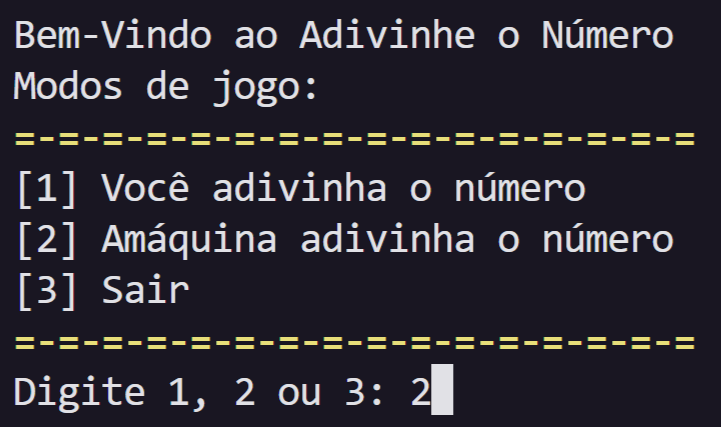

# Acerte o Número — Modo Padrão e Modo Máquina

Este é um jogo simples desenvolvido em **Python** para jogar "Acerte o Número" contra a máquina. O jogo possui dois modos:  
- **Modo Padrão**, onde você tenta adivinhar o número escolhido pela máquina, baseado na dificuldade selecionada;  
- **Modo Máquina**, onde a máquina tenta adivinhar o número que você pensou, utilizando suas respostas para ajustar os palpites.

---

### 🕹 Como Jogar:
> No momento, não é possível jogar o jogo online. (Por enquanto...)

- ### Primeiro método: Clonando o repositório

1. Clone este repositório Git:
    ```bash
    git clone https://github.com/JoaoMarceloGuastala/acerteONumeroPython
    ```
2. Abra o arquivo `main.py` em seu editor de código.

- ### Segundo método: Baixando o arquivo ZIP

1. Baixe o arquivo ZIP deste repositório.  
2. Clique em `<> Code` (ou `<> Código`, se seu GitHub estiver em português).  
3. Depois clique em `Download ZIP` (ou `Baixar ZIP`).  
4. Abra seu gerenciador de arquivos, clique com o botão **direito** na pasta baixada e selecione **Extrair aqui**.  
5. Execute o arquivo `main.py` e divirta-se.

---

### 🔬 Tecnologias utilizadas:  
- **Python**: Todo o código foi desenvolvido em Python.  
- **Bibliotecas padrão do Python** (não é necessário instalar nada extra):  
  - `random`: usado para a máquina escolher números aleatoriamente.  
  - `os`: usado para limpar o terminal de forma compatível com Windows, Linux e macOS.

---

### ⌨ Sobre o desenvolvimento

Este projeto utilizou algumas técnicas avançadas que estou estudando. Alguns exemplos importantes:

- **Retorno múltiplo (tupla) na função `dificuldade()`**  
  A função retorna uma tupla com três valores: valor mínimo, valor máximo e o número de tentativas permitidas. Exemplo:  
  ```python
  while True:
      try:
          escolha_nivel = int(input('Digite o número da dificuldade que deseja: '))
          if escolha_nivel == 1:
              limpar_tela()
              return 0, 10, 5
          elif escolha_nivel == 2:
              limpar_tela()
              return 0, 50, 7
          elif escolha_nivel == 3:
              limpar_tela()
              return 0, 100, 10
          else:
              print('Escolha apenas 1, 2 ou 3.')
      except ValueError:
          print('\033[1;49;31mDigite apenas números.\033[0m')

- **Algoritmo de busca binária na função `maquina_adivinha()`**
    Essa função faz o computador “adivinhar” seu número usando a técnica de busca binária, que divide repetidamente o intervalo de possibilidades ao meio, ajustando os palpites conforme suas respostas. Isso garante uma busca muito eficiente.

    ```python
    def maquina_adivinha():
        print('Pense em um número que vou tentar acertar.')
        minimo, maximo, limite = dificuldade()
        tentativas = 0
        acertou = False
    
        regras()
    
        while minimo <= maximo:
            palpite = (minimo + maximo) // 2
            tentativas += 1
            print(f'Meu palpite é: {palpite}')
            resposta = input("É esse o número? (+ / - / = / se precisar de ajuda digite: ? ): ")
    
            if resposta == '=':
                limpar_tela()
                print(f'\033[1;49;32mAcertei o número em {tentativas} tentativas!\033[0m')
                acertou = True
                break
            elif resposta == '+':
                minimo = palpite + 1
            elif resposta == '-': 
                maximo = palpite - 1
            elif resposta == '?':
                regras()
            else:
                print("\033[1;49;31mResponda apenas com '=', '+', '-' ou '?'\033[0m")
        if not acertou:
            print('\033[1;49;31mAlgo deu errado! Suas respostas não batem com as possibilidades possíveis.\033[0m')
    ```
- **Códigos ANSI para colorir o terminal**
    Sequências como `\033[1;49;33m` são códigos ANSI usados para aplicar cores e estilos na saída do terminal, tornando a interface mais visual e agradável.

---

### ℹ Observações:    
Esse jogo foi feito para melhorar minhas habilidades em desenvolvimento python, então não espere muito.

---

### Imagem do jogo:
Aqui está um exemplo da tela final do jogo Acerte o Número:
- 

### Licença:
Este projeto está licenciado sob a [MIT License](https://opensource.org/licenses/MIT).

---

Acesse o repositório do projeto [aqui](https://github.com/JoaoMarceloGuastala/acerteONumeroPython)

--- 

### Outros Projetos e Meu Perfil no GitHub

Se você gostou deste projeto, confira também outros trabalhos que desenvolvi:

- [Projeto 1 - Pedra, Papel e Tesoura (Jokempô) feito em HTML, CSS e JavaScript](https://github.com/JoaoMarceloGuastala/pedraPapelTesouraFrontEnd)
- [Projeto 2 -  Pedra, Papel e Tesoura (Jokempô) feito em Python](https://github.com/JoaoMarceloGuastala/pedraPapelTesouraPython)

Para ver todos os meus projetos, visite meu perfil no GitHub:

👉 [JoaoMarceloGuastala no GitHub](https://github.com/JoaoMarceloGuastala)

---
Obrigado e até mais, terráqueos! 🖖🏻

---


